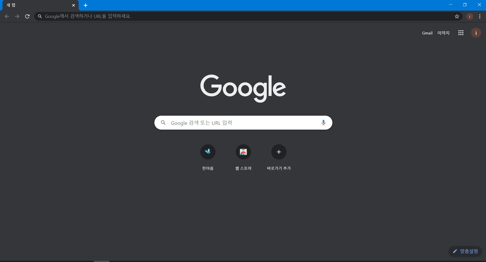
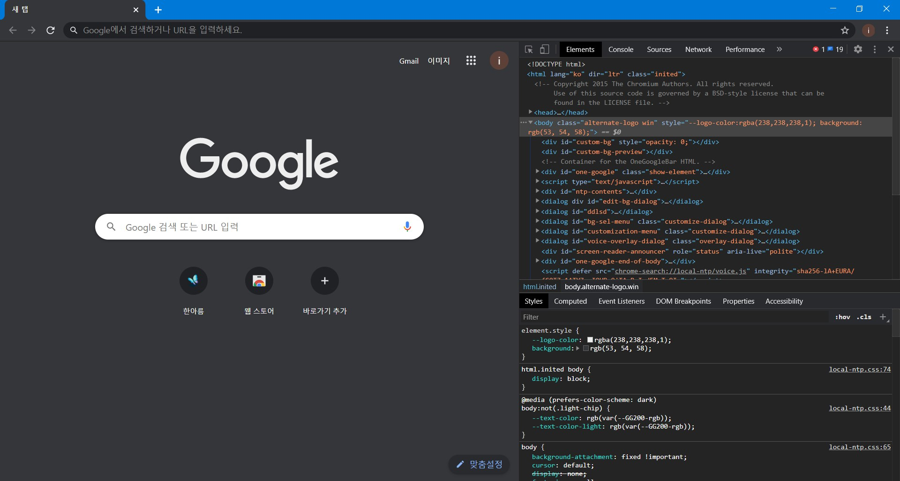
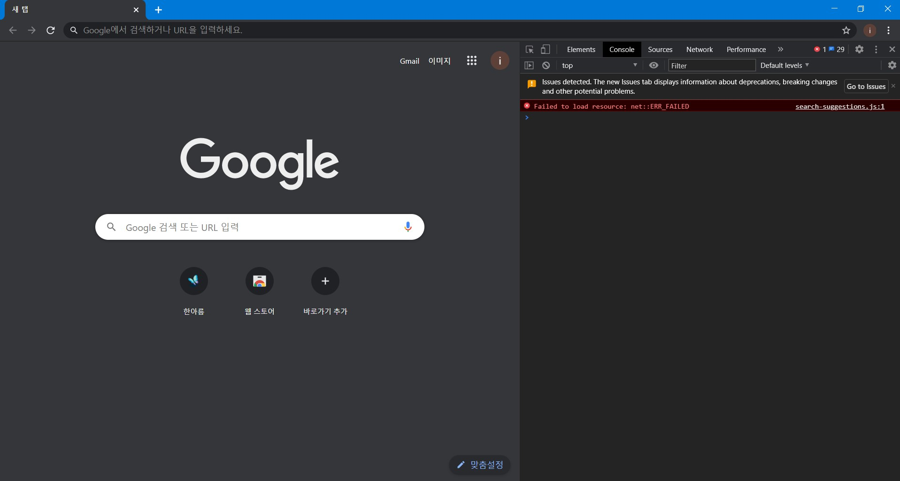
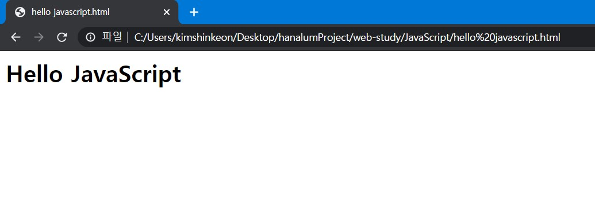
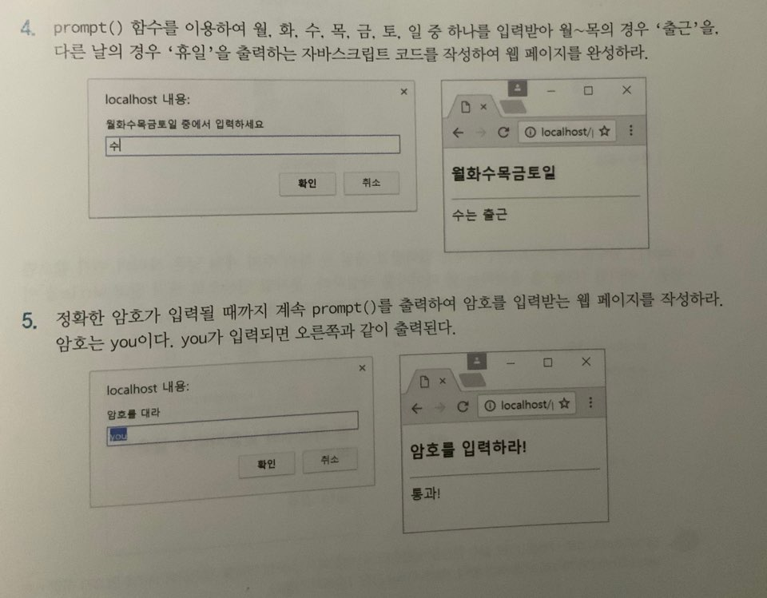

# 자바스크립트 시작
## 국민대학교 김신건


---

# 목차

### - 자바스크립트란
### - 자바스크립트의 역할
### - 콘솔창과 document.write
### - prompt(), confirm(), alert()
### - 데이터 타입
### - 변수, 상수와 연산자
### - 이벤트 리스너 속성으로 자바스크립트 사용하기
--- 
# 주의사항

1. C언어 혹은 python 등의 프로그래밍 언어를 안다고 가정하고 만들어진 스터디 내용입니다.

2. HTML, CSS로 어느정도의 웹 사이트를 구성할 수 있다고 가정하고 만들어진 스터디 내용입니다.

---
# 자바스크립트란?

- 1955년 넷스케이프사에서 개발되고 Netscape Navigator 2.0 브라우저에 최초로 탑재된 언어이다(.. 라고 하지만, 우리는 이런게 안궁금하죠?)

- 그럼 뭐를 알아야 할까
- HTML은 웹 페이지의 내용을 구성하고, CSS는 웹페이지를 꾸미는 데 쓰이고, JS는 `웹페이지를 동적으로 만드는데 쓰인다는 것 ` 이것이 중요합니다!

---
# 자바스크립트의 역할
(대충 보고 넘어가도 되는 내용입니다.)
- 사용자의 입력 및 계산 처리
- 웹 페이지 내용 및 모양의 동적 제어
- 브라우저 제어
- 웹서버와의 통신
- 웹 애플리케이션 통신

###### 출처: HTML5 + CSS3 + JAVASCRIPT 웹프로그래밍 황기태 저
---
# 콘솔창
- 먼저 아래 화면과 같이 크롬창을 켜봅시다.



---
# 콘솔창

- 그리고 F12 키를 눌러 크롬 개발자 도구를 켜봅시다.
- F12로 안열린다면 [여기](https://developers.google.com/web/tools/chrome-devtools?hl=ko)를 참고해주세요.



--- 

# 콘솔창

- 그리고 상단에 Console 혹은 콘솔을 클릭하여 콘솔창으로 들어가봅시다.



--- 

# 콘솔창

- 그리고 여러분이 아는 python 코드, c코드 등등 한번 입력해보시면 됩니다! (이 콘솔창이 바로 js 코드를 돌려볼 수 있는 곳이니까..)
- 자세한 문법은 이후에 다뤄보겠습니다.

--- 

# document.write()

- 이번에는 한번 아무곳에서나 html 확장자를 가진 파일을 만들어줍니다.
- 그리고, 아래 코드를 입력해볼까요?
```html
<html>
<head></head>
<body>
    <script>
        document.write("<h1>Hello JavaScript</h1>");
    </script>
</body>
</html>

```
---

# document.write()

- 그리고 이제 한번 만든 파일을 크롬으로 열어보겠습니다.



- 그러면, 위와 같이 우리가 document.write 안에 작성한 텍스트가 나타납니다.

- 아, 그러면 여기서 document.write는 JS로 HTML 내부에 HTML 컨텐츠를 넣을 수 있다는 것이겠죠?

---

# prompt(), confirm(), alert()
## prompt()
- prompt는 다이얼로그를 출력하고 사용자로부터 입력을 받고 이를 리턴해주는 함수입니다. 아래와 같이 코드를 작성한 파일을 만들고 실행해보세요!
```html
<html>
<body>
    <script>
        var ret = prompt("아무거나 입력해보세요", "아무거나");
        if(ret == null || ret == "") {
            document.write("진짜 아무것도 입력 안해?");
        }
        else {
            documet.write(ret);
        }
    </script>
</body>
</html>
```
---
# prompt(), confirm(), alert()
## confirm()
- confirm은 어떠한 메세지와 확인 취소 버튼을 가진 다이얼로그를 출력해줍니다.
```html
<html>
<body>
    <script>
        var ret = confirm("동의하십니까?");
        if(ret == true) {
            document.write("동의하셨습니다.");
        }
        else {
            documet.write("취소하셨습니다.");
        }
    </script>
</body>
</html>
```
---

# prompt(), confirm(), alert()
## alert()
- alert()는 단순 다이얼로그를 출력해줍니다.
```html
<html>
<body>
    <script>
        alert("alert!!!!!!");
    </script>
</body>
</html>
```
---
# 과제1

- js 코드 중
document.write(), prompt(), confirm(), alert()를 간단한 웹 페이지를 만들어보세요.

- 단순한 예제여도 좋습니다.


--- 
# 과제2

- 아래 두 문제를 푼 코드를 각각, 4.html, 5.html로 만들어주세요.



---
## 잠시 여기까지!

아래 내용은 바로 다음주에 업로드됩니다.
#### - 데이터 타입
#### - 변수, 상수와 연산자
#### - 이벤트 리스너 속성으로 자바스크립트 사용하기

---